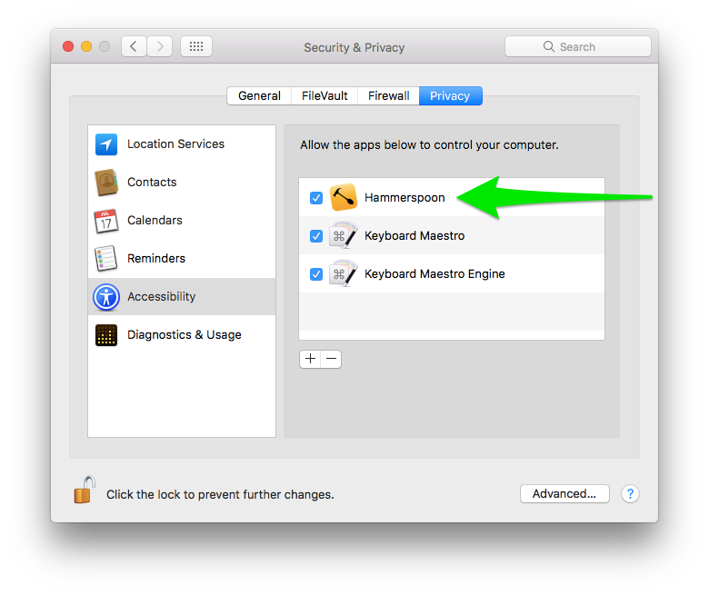

## Dependencies

This setup is honed and tested with the following dependencies.

- macOS Catalina, 10.15.5
- [Hammerspoon 0.9.78][hammerspoon]

## Installation

1. Clone this repo and then run the script. This will install Hammerspoon and set up all of the configurations.

    ```sh
    git clone https://github.com/mikebartGN/window-layout-mode.git ~/.window-layout-mode

    cd ~/.window-layout-mode

    script/setup
    ```

2. Enable accessibility to allow Hammerspoon to do its thing 
[](screenshots/accessibility-permissions-for-hammerspoon.png)


### Window Layout Mode

Quickly arrange and resize windows in common configurations, using keyboard shortcuts. (Feel free to [choose your own keyboard shortcuts](#choose-your-own-keybindings).)

#### Default keybindings

Use <kbd>control</kbd> + <kbd>s</kbd> to turn on Window Layout Mode. Then, use any shortcut below to make windows do your bidding. For example, to send the window left, hit <kbd>control</kbd> + <kbd>s</kbd>, and then hit <kbd>h</kbd>.

- Use <kbd>h</kbd> to send window left (left half of screen)
- Use <kbd>j</kbd> to send window down (bottom half of screen)
- Use <kbd>k</kbd> to send window up (top half of screen)
- Use <kbd>l</kbd> to send window right (right half of screen)
- Use <kbd>shift</kbd> + <kbd>h</kbd> to send window to left 40% of screen
- Use <kbd>shift</kbd> + <kbd>l</kbd> to send window to right 60% of screen
- Use <kbd>i</kbd> to send window to upper left quarter of screen
- Use <kbd>o</kbd> to send window to upper right quarter of screen
- Use <kbd>,</kbd> to send window to lower left quarter of screen
- Use <kbd>.</kbd> to send window to lower right quarter of screen
- Use <kbd>space</kbd> to send window to center of screen
- Use <kbd>enter</kbd> to resize window to fill the screen
- Use <kbd>n</kbd> to send window to the next monitor
- Use <kbd>←</kbd> to send window to the monitor on the left (if there is one)
- Use <kbd>→</kbd> to send window to the monitor on the right (if there is one)
- Use <kbd>control</kbd> + <kbd>s</kbd> to exit Window Layout Mode without moving any windows

[](https://cloud.githubusercontent.com/assets/2988/22397114/715cc12e-e538-11e6-9dcd-b3447af0d9dd.png) [](https://cloud.githubusercontent.com/assets/2988/22397111/45672fe6-e538-11e6-905d-5b0234e290bb.png)

#### Choose your own keybindings

Window Layout Mode ships with the default keybindings above, but you're welcome to personalize this setup. See [`hammerspoon/windows-bindings-defaults.lua`](hammerspoon/windows-bindings-defaults.lua) for instructions on configuring shortcuts to your personal taste.


[hammerspoon]: http://www.hammerspoon.org